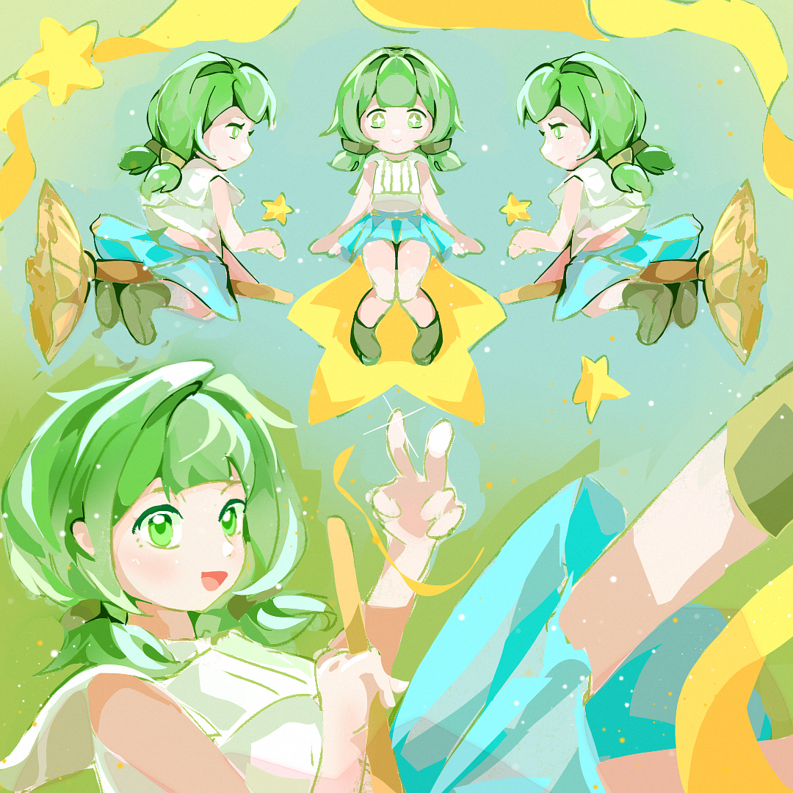
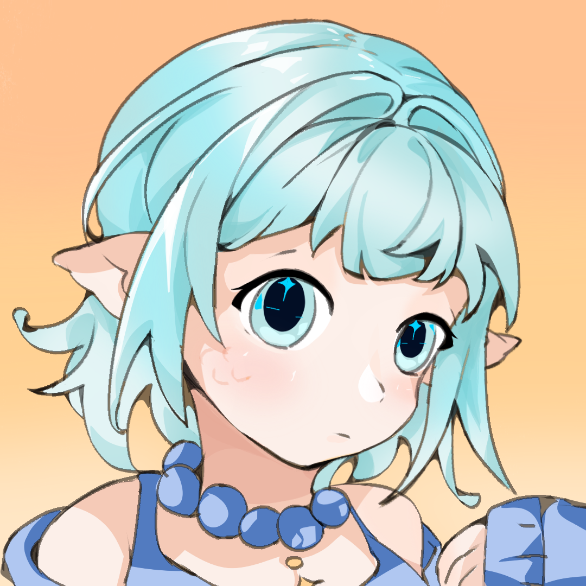

# 魔女试炼 / Witch Trial

<p align="center">
  <a href="https://muyuxuanzhi.github.io/witch-trial/"></a>
  
  
  
</p>

<p align="center">
  
</p>

清新星光像素风的**横屏双轨跑酷 + 弹幕 Boss 战**肉鸽游戏。仅用**上下键**在双轨间穿行、躲避障碍、收集试炼值进化形态；攒满目标后选择武器，进入弹幕 Boss 战决战魔女。原生 HTML5 Canvas + ES Modules 自研引擎，零构建、静态可部署，电脑与手机端通用。

> 由早期跑酷原型「霓虹疾跑」演进而来，现已发展为带关卡、剧情、Boss 与肉鸽成长的完整可玩版本。

## 主角介绍



**叶林 · 森林魔女**

森林魔女学院的见习生，一头亮绿到青绿渐变的蓬松短发，双侧扎着绿色发带小辫，翠绿的大眼睛里满是好奇，脸颊点缀着淡淡雀斑与腮红。她穿着缀满星光的白绿短上衣、青蓝渐变短裙与绿色小靴，随身携带一把会发光的金色扫帚。

天性活泼、乐观好动，比起乖乖念书更爱追着流星跑。为了通过成为正式魔女的「试炼」，她踏上五段截然不同的秘境旅程——一路收集散落的**魔法星星**积累试炼值，在星光中逐级**进化形态**（水手服少女 → 见习魔女 → 进阶魔女 → 扫帚魔女），最终骑上扫帚、举起法杖，与盘踞在祭坛的**月蚀魔女**决战。

**背景故事**：叶林并非天赋型的魔女——她的魔力总差临门一脚，被学院评为「勉强及格」。但她相信只要收集到足够的星光，就能证明自己也能成为独当一面的魔女。五段试炼，是学院给每位见习生的毕业考，也是她与自我怀疑的对峙。

| 设定项 | 内容 |
|---|---|
| **姓名** | 叶林 |
| **身份** | 森林魔女学院 · 见习魔女 |
| **性格** | 元气、好奇、莽撞又坚韧，不服输 |
| **动机** | 集齐星光、通过试炼、成为真正的魔女 |
| **法器** | 会发光的金色扫帚（终极形态可骑乘） |
| **口头禅** | 「深呼吸……我准备好了！」 |

> 设定与玩法呼应：她收集的「星星」正是游戏里的试炼值，形态进化对应四段外观成长，骑扫帚形态即终极形态「扫帚魔女」——**美术、剧情、数值三线合一**。

---

### 可解锁角色：金橙 · 黄金魔女


在商城花费 **150 金币**即可解锁的第二个可玩魔女。

**金橙**是慵懒的电波系魔女，最爱坚果巧克力与一切金灿灿的东西。为了通关后兑现大魔女朋友的约定——**10 万箱金箔坚果巧克力**，金橙拼尽全力。口头禅：「为了金灿灿和甜品……power！！！」解锁后同样从**水手服少女**初始形态出发，通过试炼逐级进化，走完整条形态进化线。

> **剧情彩蛋**：通关并解锁黄金魔女皮肤，触发隐藏彩蛋「终极甜蜜」——10 万箱金箔坚果巧克力。

---

### 可解锁角色：海於 · 碧海魔女



在商城花费 **40 金币**即可解锁的第三个可玩魔女。

**海於**喜欢独处，胜过热闹的人群，更愿意和海洋动物待在一起。她们一族天生拥有海之力，只要通过魔女试炼，海之力就会进化得更庞大。为了拿到大魔女补贴——一间带花园的独栋小屋，海於带上自己的鲸鱼伙伴去参加试炼。口头禅：「嗯？你说作弊？那可是我海之力契约的伙伴哎，也就是说是我的一部分，哼哼~」

> **先天能力**：跑酷阶段自带一只蓝色鲸鱼跟随伙伴，每 30 秒攒 1 层**不可叠加**的护盾，抵挡一次碰撞伤害；Boss 战中鲸鱼协同开火辅助输出。

---

## 核心玩法

- **↑ / W**：切上轨　**↓ / S**：切下轨（手机：上滑 / 下滑全屏任意位置切轨）
- 跑酷阶段：躲红色障碍、吃金色光点，**收集试炼值**；每攒够一定量触发**三选一 Buff**并进化魔女形态
- 达到本关目标后进入**武器选择**，再进入**弹幕 Boss 战**
- Boss 战：纵向移动走位、射击输出，收集**六芒星**触发狂暴；击败 Boss 通关解锁下一关

## 内容一览

- **5 个关卡**：各有独立配色、剧情 Intro、目标与 Boss
- **5 个 Boss**：蘑菇 / 藤蔓 / 石魔 / 幽灵 / 月蚀魔女，各自弹幕形态
- **武器系统**：Boss 战前多种武器可选（射速 / 伤害 / 弹型各异）
- **三选一 Buff**：护盾结界 / 迅捷 / 双倍 / 破障 / 幸运等，成长驱动
- **魔女形态进化**：随累计试炼值逐级进化（水手服少女 → 见习魔女 → 见习魔女·进阶 → 扫帚魔女）
- **♾ 无限模式**：Boss 每轮从 5 个里随机、收集度与属性**无限叠加**、目标逐轮递增，挑战能撑到第几轮
- **🔥 地狱难度**：三命定生死 · Boss 血量 ×3 · 破障魔法改为耐撞翻倍
- **🏆 成就系统**：20 个成就（含 5 个隐藏），覆盖收集物 / 通关 / 无限模式 / 战斗风格 / 经济等维度，每个成就都有独一无二的菱形手绘图标
- **🛒 商城系统**：购买角色皮肤（森林魔女·叶林默认 / 碧海魔女·海於 / 绯红魔女 / 黄金魔女·金橙）、场景皮肤、障碍皮肤、武器，金币通过游戏获得
- **📖 图鉴系统**：角色设定（含叶林 & 金橙 & 海於）、Buff 增益、Boss 图鉴，支持滚动浏览

## 本地运行

```bash
python -m http.server 5500   # 或 npx serve .
# 浏览器打开 http://localhost:5500
```

## 目录结构

```
neon-runner/
├─ index.html
├─ css/style.css
├─ assets/               角色设定图与封面素材
└─ src/
   ├─ main.js
   ├─ engine/             Game(循环/像素缩放/场景栈) · Input · Scene · Audio
   ├─ data/
   │  ├─ config.js        全部手感/难度参数集中可调
   │  ├─ levels.js        关卡数据 + 无限模式生成器
   │  ├─ bosses.js        Boss 弹幕配置
   │  ├─ weapons.js       武器定义
   │  ├─ buffs.js         三选一 Buff 定义
   │  ├─ witchForms.js    魔女形态进化
   │  ├─ skins.js         皮肤数据（角色/背景/障碍/武器）
   │  ├─ difficulty.js    普通/地狱难度定义
   │  └─ achievements.js  成就系统（20个成就定义+菱形图标绘制）
   ├─ systems/
   │  ├─ Player.js        双轨切换 + 切轨插值 + 拖尾 + 挤压拉伸 + 形态
   │  ├─ Spawner.js       程序化障碍/光点生成 + 难度爬升
   │  ├─ Particles.js     粒子反馈（juice）
   │  ├─ Background.js    多层视差滚动背景
   │  └─ Save.js          localStorage 存档（金币/最高分/皮肤/关卡解锁/成就进度）
   └─ scenes/
      ├─ MenuScene.js           主菜单（含难度切换）
      ├─ LevelSelectScene.js    选关 + 无限模式入口
      ├─ IntroScene.js          关卡剧情对话
      ├─ RunScene.js            跑酷（碰撞/计分/试炼收集/形态进化/Buff三选一）
      ├─ WeaponSelectScene.js   武器选择
      ├─ BossScene.js           弹幕 Boss 战
      ├─ ShopScene.js           商城（皮肤购买/装备）
      ├─ CodexScene.js          图鉴（角色/Buff/Boss）
      └─ AchievementsScene.js   成就页面（20个成就+滚动浏览+隐藏页）
```

## 技术看点

- 自研游戏循环（dt 上限、场景栈）与整数放大像素渲染管线
- **程序化内容生成**：障碍/光点随机布轨 + 难度随时间爬升
- **肉鸽成长系统**：试炼值 → 形态进化 + 三选一 Buff，Buff 在 Boss 战换算成实战属性
- **无限模式**：跨轮 carry 累加（Buff / 收集度 / 试炼值），Boss 随机、目标逐轮递增
- **弹幕 Boss 战**：多形态弹幕、六芒星狂暴机制、走位射击
- **成就系统**：20 个成就，含隐藏/搞笑/剧情彩蛋，手绘菱形图标，存档自动同步
- **手感/juice 全家桶**：切轨挤压拉伸、拖尾、粒子爆发、屏震、碰撞顿帧
- 参数集中在 `config.js`，可快速调优
- 电脑端键鼠 + 手机端触屏双适配，480×270 内部分辨率，支持全屏

## 存档

localStorage 持久化：金币、最高分、已购/已装备皮肤、关卡解锁进度、成就进度统计和已解锁成就列表。无限模式仅累加金币，不影响关卡解锁。新版本存档自动向前兼容旧版数据。

---

## 关于作者

我是 **muyuxuanzhi**，本项目从策划设计到全部代码独立完成：关卡/Boss弹幕设计、肉鸽成长与经济数值、商城/图鉴/成就/存档系统均为自研（美术素材见 `assets/`）。目前在找 **游戏策划（数值 / 系统设计）** 或 **游戏客户端 / 玩法程序员（Unity · Unreal · 自研引擎方向）** 相关机会，欢迎交流 🙌

更多项目与技术栈 → 我的 [GitHub 主页](https://github.com/muyuxuanzhi)
